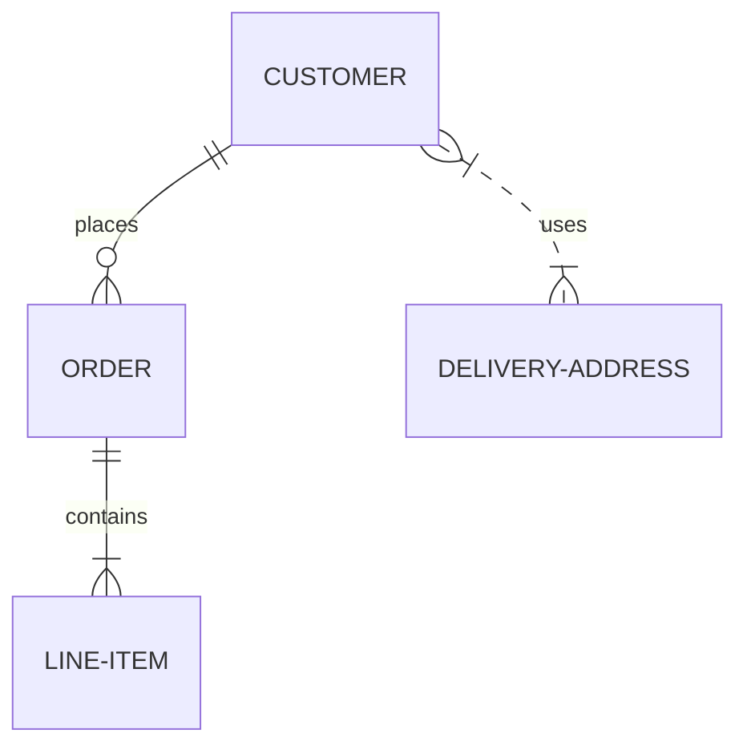
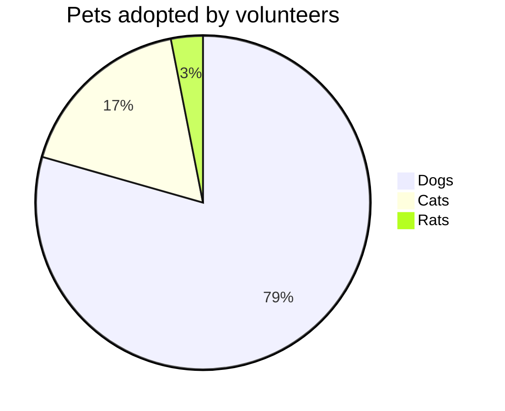

# use vscode extension to preview

```mermaid
erDiagram
    CUSTOMER ||--o{ ORDER : places
    ORDER ||--|{ LINE-ITEM : contains
    CUSTOMER }|..|{ DELIVERY-ADDRESS : uses
```

```mermaid
pie title Pets adopted by volunteers
    "Dogs" : 386
    "Cats" : 85
    "Rats" : 15
```