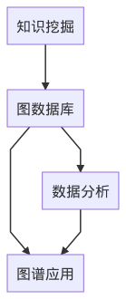

# 知识图谱构建技术与最佳实践

关键词：知识图谱、图数据库、数据模型

2021.10.18
苏锦华

---

# 引子

> One hidden layer Perception with non-linear activation function       -- Logistic Regression

知识图谱、图神经网络概念火热，国内有成熟的知识图谱产品吗？

知识图谱技术落地需要 **表子好看，里子实在**。

---

<!-- todo: use html and css language to make align the picture -->

---

# 背后依托的技术

- 数据存储：图数据库
- 数据分析：图算法及可视化技术
- 知识挖掘：NLP
- 图谱应用：图表征以及图神经网络

