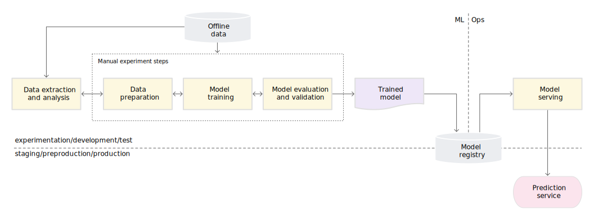

# 知识图谱构建与应用最佳实践

关键词：知识图谱、图数据库、数据模型、MLOps、知识提取、图表征

2021.10.18
苏锦华

Presetation available at: https://github.com/SmartDataLab/KG-Share

Written with Marp and Mermaid on Markdown

---

# 引子

> One hidden layer Perception with non-linear activation function       -- Logistic Regression

知识图谱、图神经网络概念火热，国内有成熟的知识图谱产品吗？

<!-- _class: lead -->
:satisfied:


知识图谱技术落地需要 **表子好看，里子实在**。


---

# 商业智能-行业数据库-知识挖掘


<!-- todo: use html and css language to make align the picture -->

---

# 背后依托的技术


1. 知识挖掘：用户交互以及NLP
2. 数据存储：图数据库 :smile:
3. 数据分析：图算法及可视化技术 :smile:
4. 图谱应用：图表征以及图神经网络


---

# 知识图谱产品架构

- MLOps System
	- Kubernetes
	- Jenkins X: MLOps [Quickstarts](https://jenkins-x.io/v3/mlops/mlquickstarts/)
	- General ML Deployment: ONNX 
- EIS: Expert Interact System
	- Human Labelling & Heuristic Algorithm
	- Monitoring & Back-testing
	- Quality: Bad Cases in KG


---

# 知识图谱产品架构 cont.

- KES: Knowledge Extraction System
	- Transfer from RDBS
	- Entity Recoginition
		- Node presentation
		- Breadth first priority search
	- Link Prediction
		- shortest path
		- NLP semantic distance
	- Attribution Extration


---

# 知识图谱产品架构 cont.

- DMP: Data Manage Platform
	- DataHub to manage the dirty data
	- Graph Database
- API Platform
	- Graph Visualization
	- Node Representation
	- Prediction Tasks
		- intelligent search(google page rank)
		- KG-based Q&A (NLP)


---

# Expert Interact System

- Brat (labelling tool) [link](http://brat.nlplab.org)


---

# 为什么要MLOps

<!-- _class: lead -->
Machine Learning: The High Interest Credit Card of Technical Debt
A paper in NIPS 2014 workshop


Rules of Machine Learning: Best Practices for ML Engineering [link](https://developers.google.com/machine-learning/guides/rules-of-ml/#training-serving_skew)


**training-serving skew** :smile:

---

# MLOps(low level)



---


# MLOps(high level)


---

# MLOps Tools(support gpu)


---

# Surprise?

Data Version Control(Boom!)

Continuous Training Pipeline


---

# Knowledge Extraction System

A structure from CSDN(author: coder_oyang)


---


# 构建工具

推荐[OpenKG](http://www.openkg.cn/)(浙大),网站整理了大量工具和相关技术文章

- 中文NLP工具:([哈工大LTP](http://ltp.ai/)，车万翔)
- 知识提取工具:[DeepKE](https://github.com/zjunlp/DeepKE)(浙大，结合prompt，适合few-shot场景)


<!-- _class: lead -->

---

# LightNER [arXiv](https://arxiv.org/pdf/2109.00720.pdf)


---

# LightRE [github](https://github.com/zjunlp/DeepKE/tree/test_new_deepke/tutorial-notebooks/re/few-shot)


---


# Data Manage Platform

思考:thinking:关系型数据库(RDBMS)与NoSQL的发展和知识图谱有什么联系

> Web2.0进入了“可读可写”模式，交互内容的急剧增加，RDBMS在超大规模数据的高并发处理力不从心,NoSQL应运而生。


---

# 图数据库的选择


---

# Neo4j生态


---

# Transfer from RDBMS


---

# Schema: Model Design


---

# Complex Case 1: 


> Property vs Relationship

```
//find which movies share genres
MATCH (m1:Movie), (m2:Movie)
WHERE any(x IN m1.genre WHERE x IN m2.genre)
AND m1 <> m2
RETURN m1, m2;
```


---

# Complex Case 2: 

> Hyperedges or Intermediate Nodes


**Cypher Target**:Coappearance

```
MATCH (a:Moment)--(b:Role) WHERE b.name == "Alias"
WITH a as a1
MATCH (a:Moment)--(b:Role) WHERE b.name == "Person"
WITH a as a2
WITH apoc.coll.intersection(a1, a2) as a3
RETURN a3
```

```
MATCH (c:Appearance = "Alias-Person")
```


---

# Complex Case 3: 


> Property vs Relationship


**Cypher Target**:Flight Date


---

# My Bad Case&A Good Case: 

**False Litigation**


**Salesman Outlier Dection**


---

# 图谱应用工具

- 知识表示：[清华大学OpenKE]()
	- RESCAL
	- DistMult, ComplEx, Analogy
	- TransE, TransH, TransR, TransD
	- SimplE
	- RotatE
- 可视化工具
	- Boom(Neo4j Lab)
	- Echarts(Baidu)


---

<!-- _class: lead -->

# Thanks